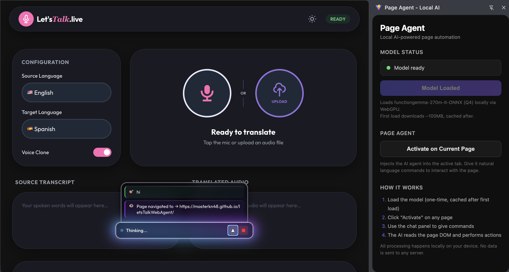

# Page Agent - Local AI Chrome Extension



A privacy-focused, high-performance Chrome extension that brings local AI capabilities directly to your browser. Powered by **Transformers.js** and **LFM2**, this extension runs large language models entirely on your machine using **WebGPU**, ensuring your data never leaves your device.

## 🚀 Features

- **Local-First AI**: Runs LLMs locally in the browser. No API keys required, no cloud costs, and maximum privacy.
- **Alibaba Page Agent Integration**: Uses [Alibaba's Page Agent](https://github.com/alibaba/page-agent) as the front-end chatbot interface. The extension injects the agent into the current tab while hosting the LLM in the background.
- **Local LLM Hosting**: Transparently provides an OpenAI-compatible API to the injected Page Agent, serving inference directly from the extension's offscreen document.
- **WebGPU Acceleration**: Leverages modern GPU hardware for fast inference. Falls back to WASM for compatibility.
- **Function Calling**: Native support for tool use and function calling with `LFM2-350M-ONNX`.
- **Side Panel Interface**: Integrated seamlessly into the Chrome side panel for quick access.
- **On-Page Agent**: Injectable chat interface that can interact with the content of any webpage.
- **OpenAI Compatible**: Implements common chat-completion structures for easy integration.

## 🛠️ Tech Stack

- **Core**: [Transformers.js v3+](https://huggingface.co/docs/transformers.js)
- **Model**: `onnx-community/LFM2-350M-ONNX`
- **Runtime**: Chrome Extension (Manifest V3)
- **Language**: TypeScript
- **Bundler**: Vite

## 📦 Installation

1. Clone the repository:
   ```bash
   git clone https://github.com/your-username/page-agent-ext.git
   ```
2. Install dependencies:
   ```bash
   bun install # or npm install
   ```
3. Build the project:
   ```bash
   bun run build # or npm run build
   ```
4. Load in Chrome:
   - Open `chrome://extensions/`
   - Enable "Developer mode"
   - Click "Load unpacked" and select the `dist` directory.

### 📥 Direct Download (Pre-built)

Alternatively, you can download the pre-built extension:
1. Download [`extension.zip`](extension.zip) from this repository.
2. Unzip the archive.
3. Load the resulting `dist` folder in `chrome://extensions/` as an unpacked extension.

## 📖 Usage

- **Side Panel**: Open the side panel to chat with the local model.
- **Model Loading**: The model will load automatically on first use. Note: First download (~500MB - 700MB) may take a moment depending on your connection.
- **Local Storage**: Models are cached locally in the browser's Cache Storage API.

## 🔒 Privacy

This extension is built with privacy as a core principle. All processing happens locally in an **Offscreen Document**. No conversation data or metadata is sent to any external server.

---

### GitHub Information

**Description:**
🚀 A private, local AI assistant for your browser. Powered by Transformers.js and LFM2, running locally via WebGPU/WASM. No cloud APIs, no data tracking.

**Keywords:**
`chrome-extension`, `local-ai`, `transformers-js`, `webgpu`, `onnx`, `function-calling`, `privacy-focused`, `browser-ml`, `lfm2`, `ai-agent`
